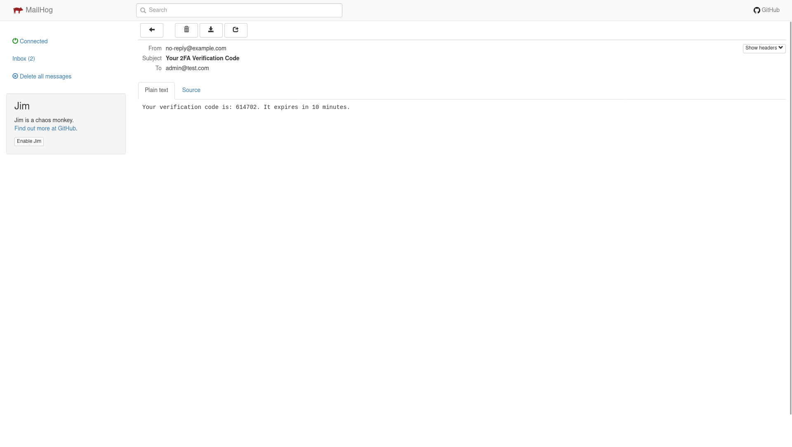

# Simple SPA with 2FA

A minimal single-page application (SPA) for user authentication with Two-Factor Authentication (2FA) built with Node.js, Express, and modern JavaScript. The app uses email-based 2FA for user registration and login, stores data in SQLite, and bundles client-side code with Webpack. MailHog is used for local email testing.

## Features

- User dashboard with dynamic URL generation
- Login page with secure login (JWT auth)
- Email 2FA verification pre-issued tokens
- SQLite database
- .ejs UI templates
- Helmet CSRF protection and secure HTTP headers
- Webpack config

## Setup

1. **Clone the repository:**
   ```bash
   git clone https://github.com/cgtwig/nodejs-auth-starter
   cd nodejs-auth-starter
   ```

2. **Install dependencies:**
   ```bash
   npm install
   ```

3. **Create a `.env` file in the project root** with the following content. Sensitive keys are left blank; generate new values using the commands provided.
   ```env
   PORT=3000
   NODE_ENV=development
   JWT_SECRET=
   # MailHog SMTP Configuration for Local Development
   SMTP_HOST=127.0.0.1
   SMTP_PORT=1025
   SMTP_SECURE=false
   SMTP_USER=
   SMTP_PASS=
   DB_PATH=./database.db
   ALLOWED_ORIGINS=http://localhost:3000,http://127.0.0.1:3000
   ALLOWED_HOSTS=localhost:3000,127.0.0.1:3000
   ENCRYPTION_KEY=
   ENCRYPTION_IV=
   CSRF_SECRET=
   ```

   **Generate .env values using terminal:**
   ```bash
   openssl rand -hex 32   # For JWT_SECRET, ENCRYPTION_KEY, and CSRF_SECRET (generate different one for each)
   openssl rand -hex 16   # For ENCRYPTION_IV
   ```
   ### 4. Setup and Run MailHog for Local 2FA Email Testing (developers only)
   #### Works on Linux, macOS, Windows via Git Bash/WSL.
   Simply paste the script into terminal and run to **install and start MailHog**. It ensures a fresh installation and resolves port conflicts automatically.
   ```bash
   # Detect OS type (Linux/macOS)
   OS=$(uname -s)
   ARCH=$(uname -m)
   
   if [ "$OS" = "Darwin" ]; then
       PLATFORM="macOS"
   elif [ "$OS" = "Linux" ]; then
       PLATFORM="linux"
   else
       echo "Unsupported OS. Please install MailHog manually."
       exit 1
   fi
   
   # Detect system architecture (x86_64/ARM)
   if [ "$ARCH" = "x86_64" ]; then
       ARCH="amd64"
   elif [ "$ARCH" = "aarch64" ]; then
       ARCH="arm"
   else
       echo "Unsupported architecture. Please install MailHog manually."
       exit 1
   fi
   
   # Define the MailHog download URL
   URL="https://github.com/mailhog/MailHog/releases/latest/download/MailHog_${PLATFORM}_${ARCH}"
   
   # Kill any process using port 1025 (without sudo) to avoid conflicts
   kill -9 $(lsof -ti:1025) 2>/dev/null || true
   
   # Download, set permissions, and run MailHog
   mkdir -p ~/bin && wget -qO ~/bin/MailHog "$URL" && chmod +x ~/bin/MailHog && ~/bin/MailHog
   ```
   ### Access MailHog UI
   - **Web UI:** [http://0.0.0.0:8025/](http://0.0.0.0:8025/) 
   - **SMTP Server:** `localhost:1025`
   
   For Windows users, download the latest `MailHog.exe` from [MailHog Releases](https://github.com/mailhog/MailHog/releases) and run:
   ```powershell
   .\MailHog.exe
   ```
   
   **Using Docker (recommended):**
   ```bash
   docker run -d -p 1025:1025 -p 8025:8025 mailhog/mailhog
   ```
   Open the MailHog web UI at [http://127.0.0.1:8025](http://127.0.0.1:8025).

   ||
   |-----------------------------------------------|


   **Without Docker:**
   - Download the appropriate MailHog binary from [MailHog Releases](https://github.com/mailhog/MailHog/releases).
   - Run the binary (by default, MailHog listens on SMTP port 1025 and serves the UI on port 8025).

6. **Build the client-side bundle:**
   ```bash
   npm run build
   ```
   This uses Webpack (configured in `webpack.config.cjs`) to bundle your code from `src/app.js` (which imports from `public/js/script.js`) into `public/js/bundle.js`.

7. **Start the server:**
   ```bash
   npm start
   ```
   The app will be available at [http://localhost:3000](http://localhost:3000).

## Development Mode

For hot-reloading and live updates during development, run:
```bash
npm run dev
```

## Project Structure

```
.
├── README.md
├── database.db
├── package-lock.json
├── package.json
├── public
│   ├── css
│   │   ├── styles.css
│   │   └── styles-two.css
│   └── js
│       ├── bundle.js          # Webpack output
│       ├── script.js          # Helper functions
│       └── uDashboard.js
├── server.js                  # Express server and API endpoints
├── src
│   └── app.js
├── views
│   ├── index.ejs
│   ├── logged-out.ejs
│   └── user-dashboard.ejs
└── webpack.config.cjs         # Webpack configuration
```

## Technologies Used

- **Backend:** Node.js, Express, Better-SQLite3, JWT, Nodemailer (2FA)
- **Frontend:** Vanilla JavaScript, EJS templates, CSS
- **Bundling:** Webpack, Babel
- **Development Tools:** Docker (for MailHog)

## Troubleshooting

- **400 Bad Request on Registration:**
  Verify that all required fields (username, email, password) and the CSRF token are correctly sent. Check the request payload in your browser's Network tab.

- **SMTP Connection Issues:**
  If errors like `ECONNREFUSED` occur, ensure MailHog is running and that `SMTP_HOST` is set to `127.0.0.1`.

- **Caching Issues:**
  If client-side changes are not reflected, rebuild the bundle (`npm run build`) and clear your browser cache.

## License

MIT
